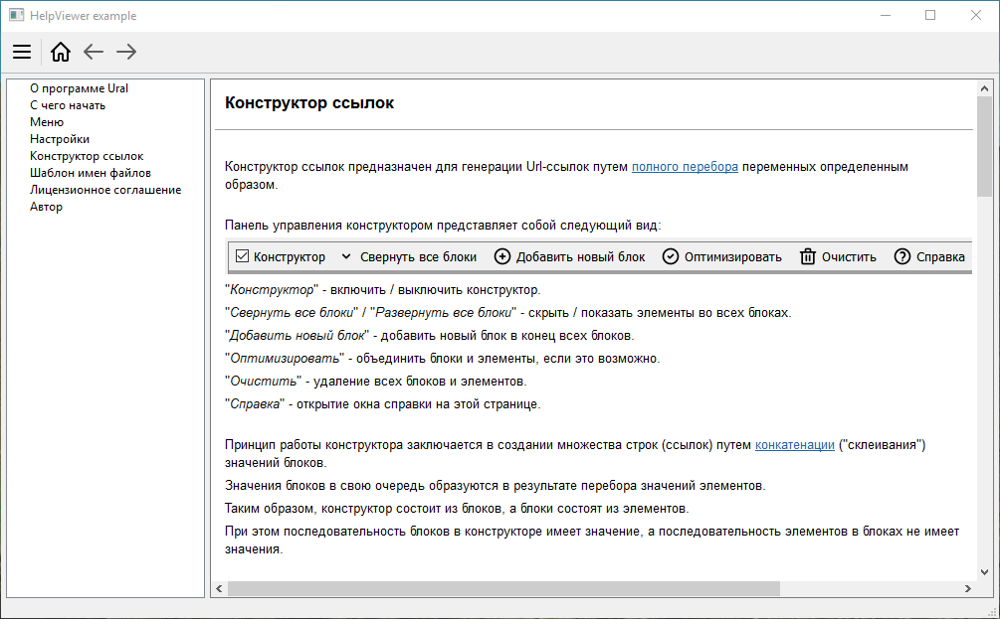

# HelpViewer
HelpViewer предназначен для отображения файлов помощи Qt (qhc, qch).

## Возможности
+ Предварительная проверка файлов помощи (Qt compressed help) на возможность их отображения перед открытием
+ Открытие файла помощи (Qt compressed help) по умолчанию (в следующем порядке: последний удачно открытый файл, index.html, index.htm, первый файл в списке зарегистрированных Qt compressed help текущего Qt Help Collection файла)
+ Открытие гиперсылок интернета в браузере по умолчанию
+ Сохранение состояния окна помощи и его воссстановление при повторном открытии
## Преимущества
По сравнению с Qt Assistant:
+ Меньший размер дистрибутива программы
+ Более простой интерфейс окна помощи, включающий только самый необходимый функционал.

По сравнению с Microsoft Compiled HTML Help (chm-файлы):
+ Кроссплатформенность
+ Интерфейс окна помощи по умолчанию имеет такой же стиль как и стиль окон основной программы.

## Пример окна помощи

## Лицензия
Copyright (c) 2018, Alexey Lukin  

MIT License. See LICENSE file